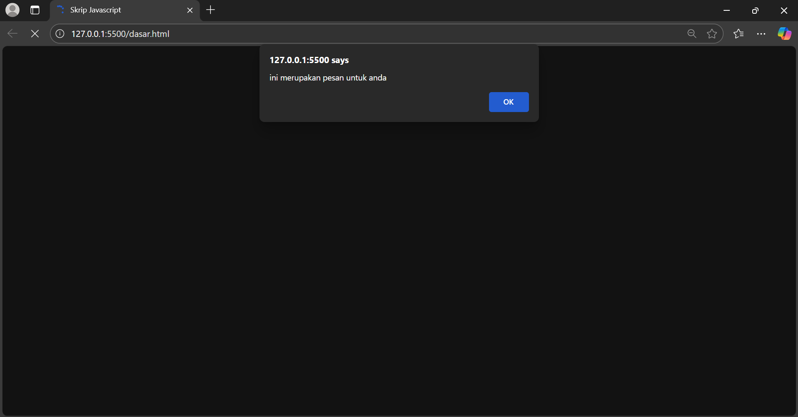
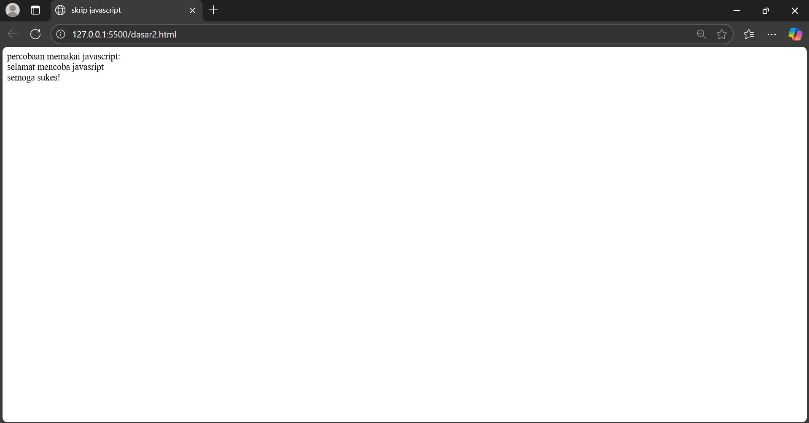
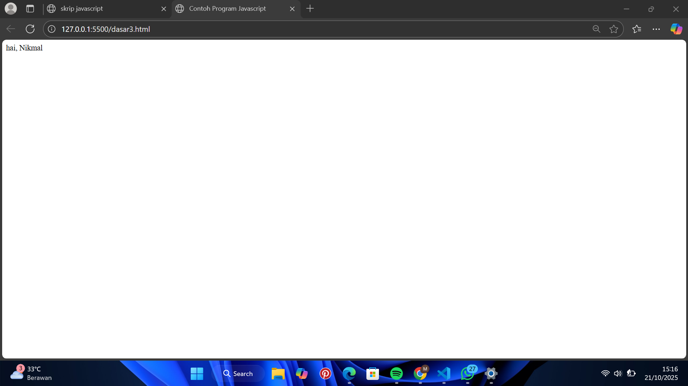
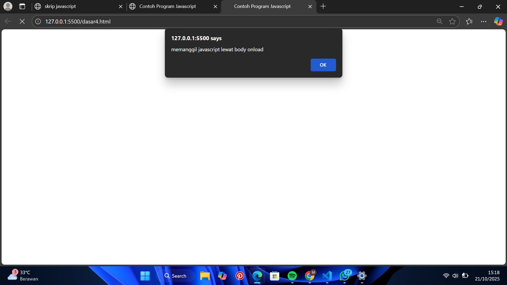
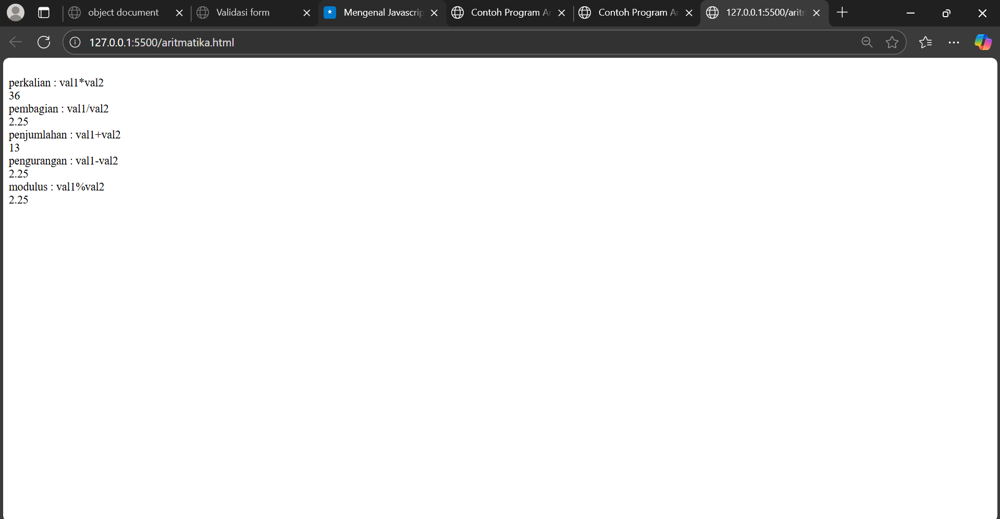
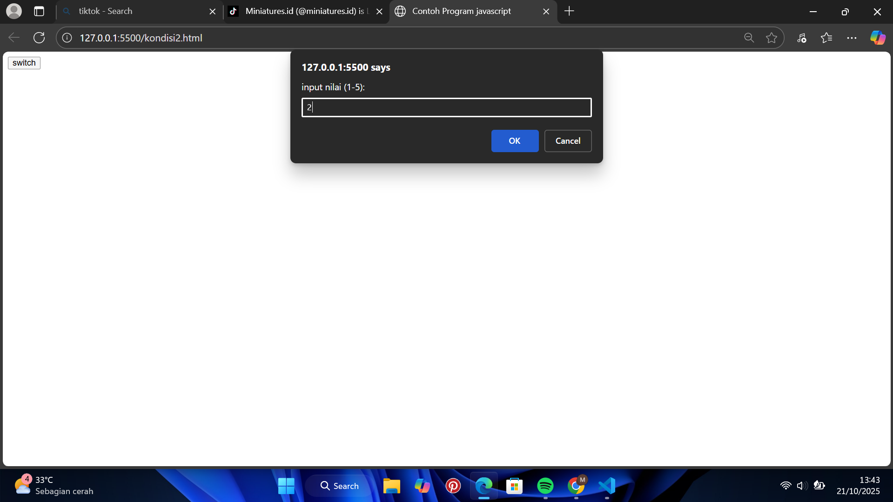
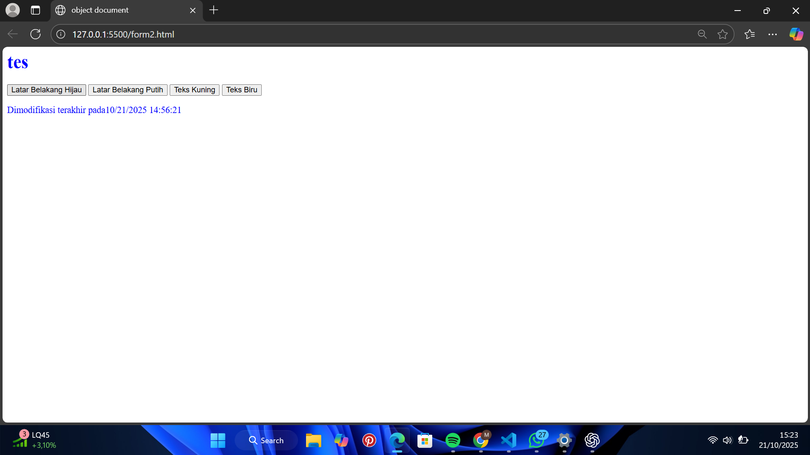
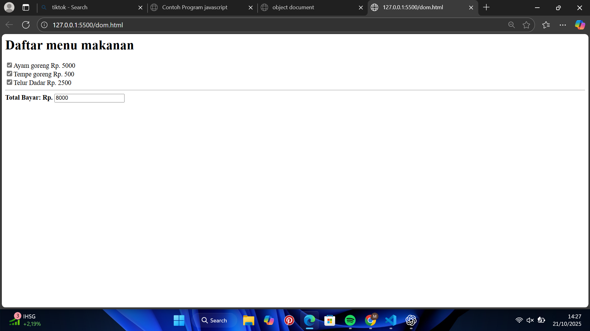

- Nama : Muhamad Nikmal Wahid
- kelas : TI 24 a3
- Pemrograman Web


# Pratikum 5: Javascript Dasar

## Intruksi Praktikum 
- Siapkan Text editor seperti VScode
- Buat file baru
- Buat struktur dasar dari dokumen HTML
- Mengikuti langkah-langkah yang tertera
- Lakukan validasi dokumen CSS

# Javascript 1 
```
<!DOCTYPE html>
<html lang="en">
<head>
    <meta charset="UTF-8">
    <meta name="viewport" content="width=device-width, initial-scale=1.0">
    <title>Mengenal Javascript</title>
</head>
<body>
    <h1>Pengenalam Javascript</h1>
    <h3>Contoh document.write dan console.log</h3>
    <script>
        document.write("hello world");
        console.log("hello world");
    </script>
</body>
</html>
```
## Javascript dasar 
Pemakaian Alert sebagai property window
```
<html>
    <head>
        <title>Skrip Javascript</title>
    </head>
    <body>
        <script language="javascript">
            window.alert ("ini merupakan pesan untuk anda");
        </script>
    </body>
</html>
```


Pemakaian method dalam objek
```
<html>
    <head>
        <title>skrip javascript</title>
    </head>

    <body>
        percobaan memakai javascript:<br>
        <script language="javascript">
            document.write("selamat mencoba javasript<br>");
            document.write("semoga sukes!")
        </script>
    </body>
</html>
```


Pemakaian prompt
```
<html>
    <head>
        <title>Contoh Program Javascript</title>
        <script language="javascript">
            var nama = prompt("siapa nama anda?", "masukkan nama anda");
            document.write("hai, " + nama);
        </script>
    </head>
</html>
```


Pembuatan fungsi dan cara pemanggilannya
```
<!DOCTYPE html>
<html lang="en">
<head>
    <title>Contoh Program Javascript</title>
    <script languange="Javascript">
        function pesan () {
            alert ("memanggil javascript lewat body onload")
        }
    </script>
</head>
<body onload=pesan()>
   
</body>
</html>
```


## Dasar Pemrograman di Javascript
Operasi dasar aritmatika
```

```


Seleksi kondisi (if.else)
```
<html>
    <head>
        <title>Contoh if else</title>
    </head>
    <body>
        <script languange="Javascript">
            var nilai = prompt("nilai (0-100): ", 0);
            var hasil = "";
            if (nilai >= 60)
            hasil = "lulus";
            else
            hasil = "tidak lulus";
            document.write("hasil: " + hasil);
        </script>
    </body>
</html>
```


Penggunaan operator switch untuk seleksi kondisi 
```
<html>
    <head>
        <title>Contoh Program javascript</title>
        <script languange="Javascript">
        function test ()
        {
            vall=window.prompt("input nilai (1-5):")
            switch (val1)
            {
                case "1" : 
                    document.write("bilangan satu")
                    break
                case "2" : 
                    document.write("bilangan dua")
                    break
                case "2" : 
                    document.write("bilangan tiga")
                    break
                case "3" : 
                    document.write("bilangan empat")
                    break
                case "4" : 
                    document.write("bilangan lima")
                    break
                default : 
                    document.write("bilangan lainnya")
                    break
            }
        }
        </script>
        <body>
            <input type="button" name="button1" value="switch" onclick="test()">
        </body>
    </head>
</html>
```


## Pembuatan Form 
Form Input
```
<!DOCTYPE html>
<html lang="en">
<head>
    <meta charset="UTF-8">
    <meta name="viewport" content="width=device-width, initial-scale=1.0">
    <title>Document</title>
    <script languange ="Javascript">
        function test () {
            var val1=document.kirim.T1.value
            if (val1%2==0)
                document.kirim.T2.value="bilangan genap"
            else
                document.kirim.T2.value="bilangan ganjil"
            
        }
    </script>
</head>
<body>
    <form method="POST" name="kirim">
        <p>BIL <input type="text" name="T1" size="20">
        MERUPAKAN BIL <input type="text" name="T2" size="20"></p>
        <p><input type="button" value="TEBAK" name="B1" onclick=test()></p>
    </form>
</body>
</html>
```


Form button
```
<html>
    <head>
        <title>object document</title>
    </head>

    <body>
        <script language="Javascript">
            function ubahWarnaLB(warna) {
                document.bgColor = warna;
            }
            function ubahWarnaLD(warna) {
                document.fgColor = warna;
            }
        </script>

        <h1>tes</h1>
        <form>
            <input type="button" value="Latar Belakang Hijau" onclick="ubahWarnaLB('GREEN')">
            <input type="button" value="Latar Belakang Putih" onclick="ubahWarnaLB('WHITE')">
            <input type="button" value="Teks Kuning" onclick="ubahWarnaLD('YELLOW')">
            <input type="button" value="Teks Biru" onclick="ubahWarnaLD('BLUE')">
        </form>

        <script language="javascript">
            document.write("Dimodifikasi terakhir pada" + document.lastModified);
        </script>
    </body>
</html>
```


## HTML DOM 
```
<html>
    <head>
        <title></title>
        <script>
            function hitung(ele) {
                var total = document.getElementById('total').value;
                    total = (total ? parseInt(total) : 0);
                var harga = 0;
                
                if (ele.checked) {
                    harga = ele.value;
                    total += parseInt(harga);
                } else {
                    harga = ele.value;
                    if (total > 0)
                        total -= parseInt(harga);
                }
                document.getElementById('total').value = total;
            }
        </script>
    </head>
    <body>
        <h1>Daftar menu makanan</h1>
        <label><input type="checkbox" value="5000" id="menu1" onclick="hitung(this);"/>Ayam goreng Rp. 5000</label><br />
        <label><input type="checkbox" value="500" id="menu2" onclick="hitung(this);"/>Tempe goreng Rp. 500</label><br />
        <label><input type="checkbox" value="2500" id="menu3" onclick="hitung(this);"/>Telur Dadar Rp. 2500</label><hr />
        <strong>Total Bayar: Rp. <input id="total" type="text" /></strong>
    </body>
</html>
```



